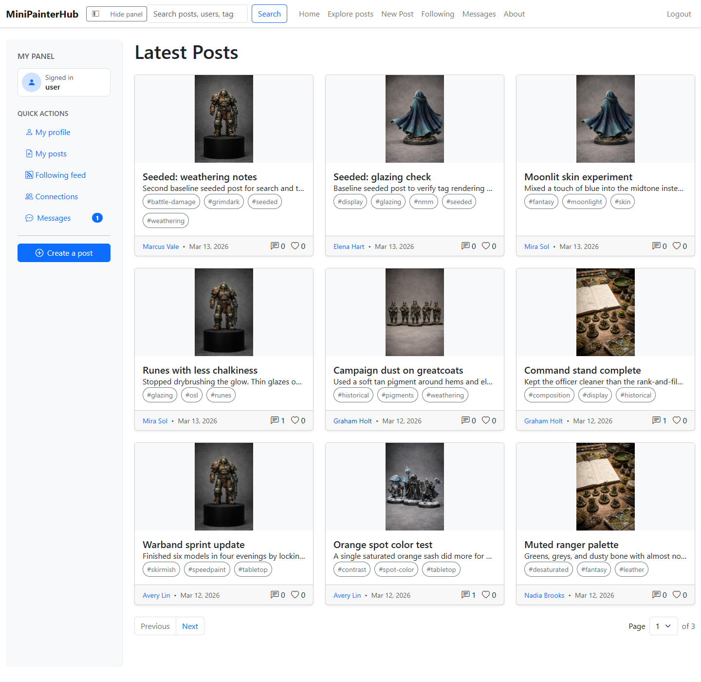
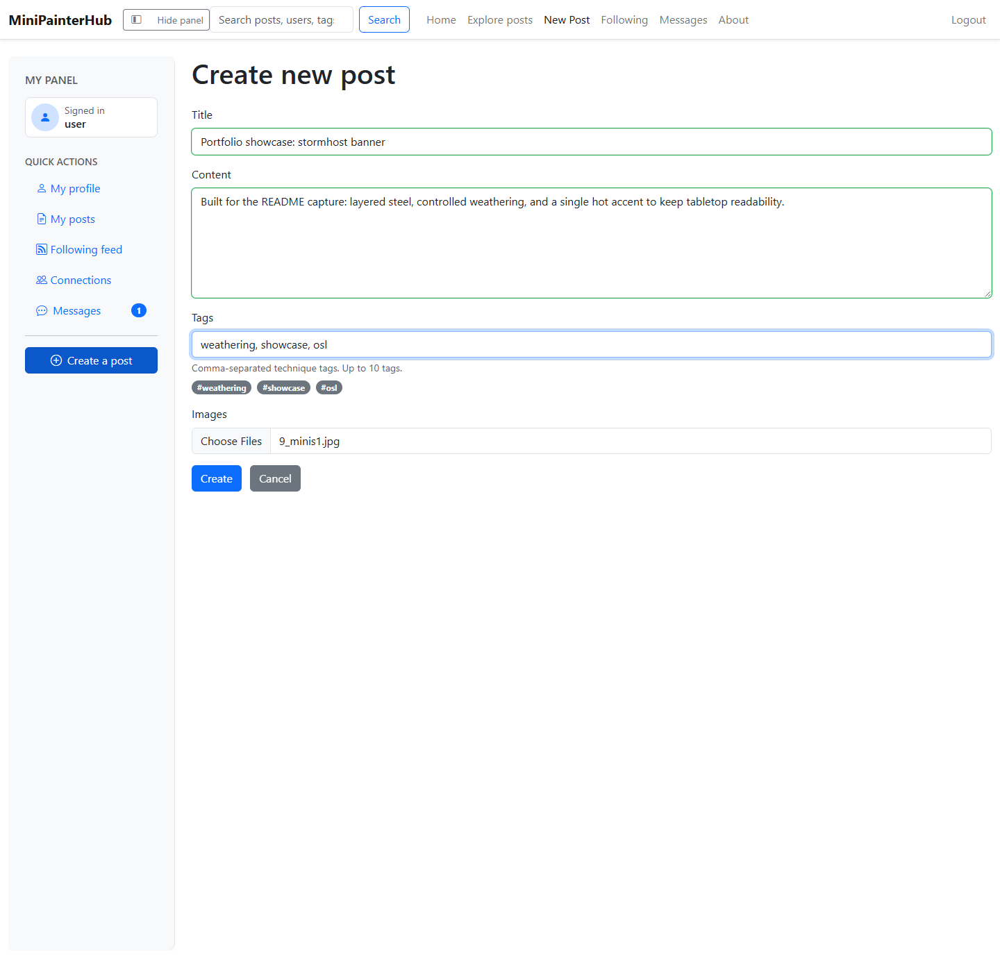
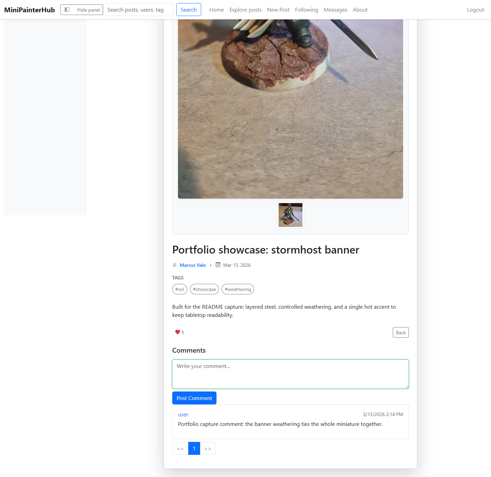
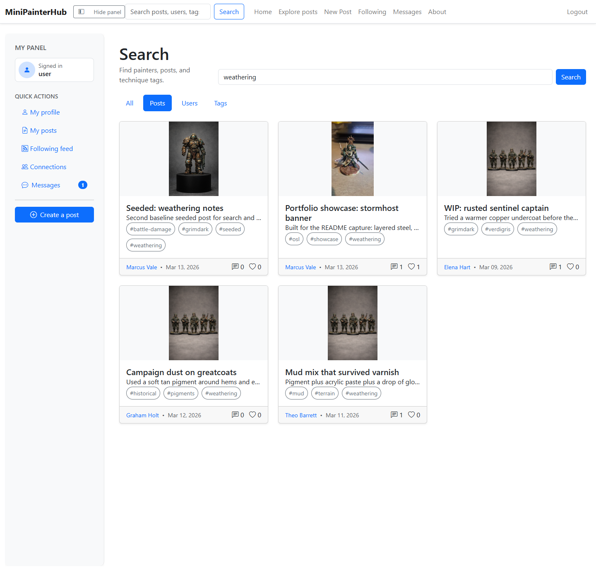
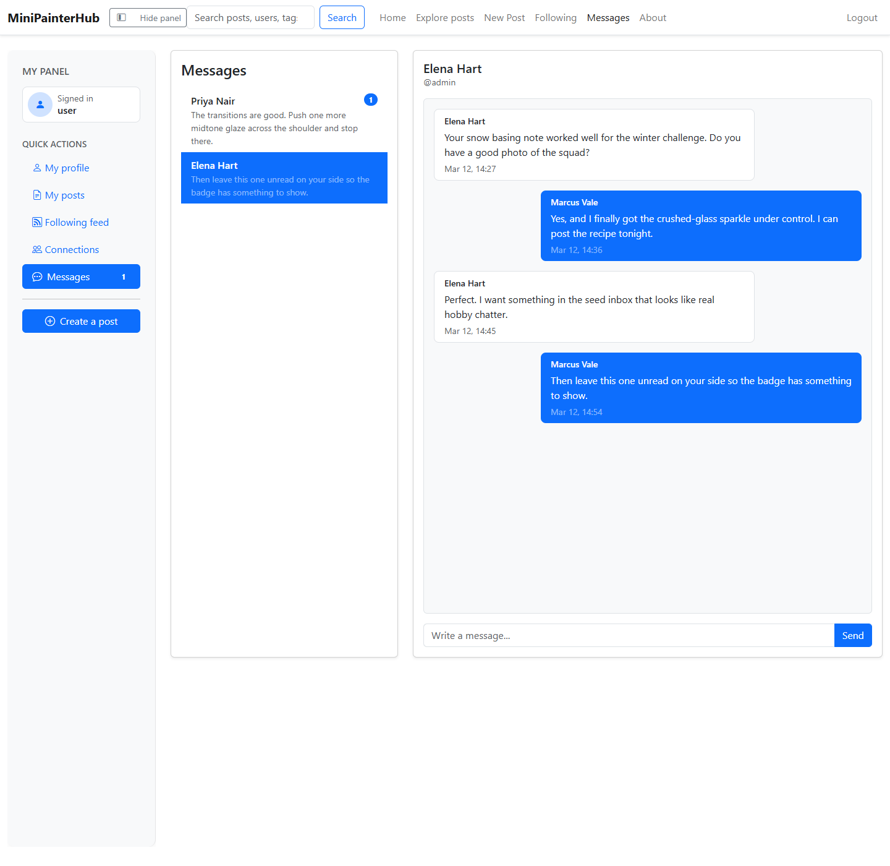
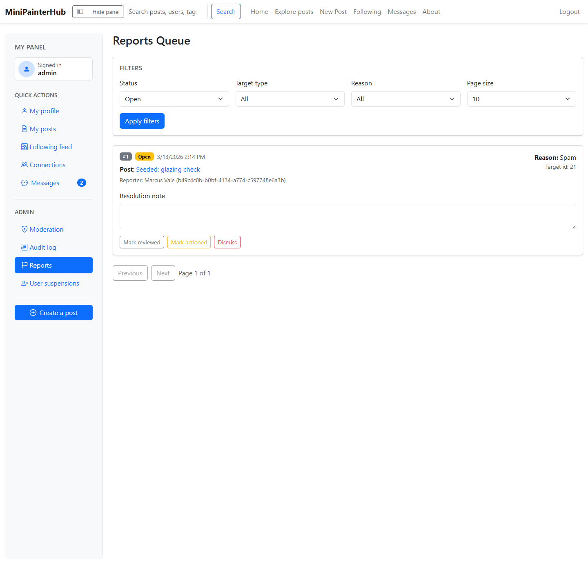

# MiniPainterHub

MiniPainterHub is a full-stack social platform for miniature painters. It combines image-first post publishing, a richer post viewing experience, social discovery, direct messaging, and admin moderation tooling in one .NET 8 application.

This repository is portfolio-oriented as much as it is product-oriented: it shows end-to-end feature work across API design, Blazor UI, authentication, real-time messaging, media handling, moderation workflows, and automated quality gates.

Screenshots in this README were captured with Playwright-MCP against a deterministic seeded development dataset.

## What It Demonstrates

- Image-backed post publishing with technique tags, comments, likes, and richer post detail flows
- JWT authentication with ASP.NET Core Identity
- Public profiles, following graph, connections, and following feed
- Cross-entity search for posts, users, and tags
- Direct messaging with SignalR-backed conversation flows
- Reporting, inline moderation, audit logging, and user suspension tools
- Rich image viewing with anchored comment-mark context
- Deterministic development seeding for realistic demo data
- A test pyramid that spans unit, component, integration, and browser smoke coverage
- A browser-reviewed UI refresh across feed, discovery, messaging, and admin surfaces

## Screenshot Tour

### 1. Latest feed

The home feed surfaces image-first post cards, technique tags, author metadata, and quick engagement counts.



### 2. Post composer

Posts can be authored with long-form content, uploaded images, and comma-separated technique tags.



### 3. Post details and rich viewing

Each post has a detail flow with media, tags, comments, likes, reporting actions, and the foundation for a richer image-viewing experience.



### 4. Discovery search

Search supports posts, users, and tags, making it easy to move from a technique to the painters using it.



### 5. Direct messages

Seeded conversations and SignalR-backed messaging give the platform a real social layer beyond comments.



### 6. Admin reports queue

Admins can review incoming reports, filter moderation work, and resolve issues from a dedicated queue.



## Feature Overview

### Painter experience

- Register and sign in with JWT-based authentication
- Create posts with one or more images
- Add reusable technique tags for discovery and filtering
- Comment on posts and like or unlike them
- Browse posts through an image-first detail experience with stronger visual emphasis on artwork
- Browse public profiles with follower and following counts
- Follow painters and browse a following-only feed
- Manage your own profile, display name, bio, and avatar
- Open direct-message conversations with other users
- Search across posts, users, and tags from global navigation

### Trust, safety, and admin workflows

- Report posts, comments, and user profiles
- Review reports from a moderation queue
- Hide and restore posts and comments without hard deletion
- Use inline moderation actions and visibility-aware review flows in the UI
- Suspend and unsuspend users
- Inspect an audit log of moderation actions
- Support maintenance-mode bypass flows for controlled access scenarios

### Engineering and platform capabilities

- ASP.NET Core API + Blazor WebAssembly frontend
- Entity Framework Core with SQL Server persistence
- ASP.NET Core Identity for account management
- JWT bearer auth between the WebAssembly client and the API
- SignalR for direct-message updates
- Local image storage in development and Azure Blob storage in non-development environments
- Development seed commands for realistic users, posts, profiles, follows, comments, avatars, and direct messages
- Browser-reviewed UI changes backed by Playwright smoke coverage

## Architecture

### Stack

- Backend: ASP.NET Core 8, Web API controllers, SignalR, ProblemDetails, Identity
- Frontend: Blazor WebAssembly, Bootstrap-based UI, typed client services
- Data: Entity Framework Core, SQL Server, shared DTO contracts in `MiniPainterHub.Common`
- Media: image processing plus local or Azure-backed storage

### Solution layout

- `MiniPainterHub.Server`: API, auth, SignalR hub, EF Core, seeding, moderation logic
- `MiniPainterHub.WebApp`: Blazor WebAssembly client and page-level UI flows
- `MiniPainterHub.Common`: shared DTOs and contracts
- `MiniPainterHub.Server.Tests`: backend service and API-focused tests
- `MiniPainterHub.WebApp.Tests`: bUnit and client-service coverage
- `e2e`: Playwright browser smoke automation

For the full technical breakdown, see [docs/ARCHITECTURE.md](docs/ARCHITECTURE.md).

## Quality

The repository now has automated coverage from basic unit tests through browser automation:

- 333 .NET tests across server and WebApp test projects
- 14 Playwright smoke scenarios covering end-to-end user and admin flows
- Unit and service-level tests for business logic and HTTP client wrappers
- bUnit coverage for Blazor pages and shared UI behavior
- Playwright smoke coverage for login, posting, search, profile flows, moderation, and reports
- GitHub Actions quality gates for build, tests, coverage, and browser smoke on pull requests

## Local Run

### Prerequisites

- .NET 8 SDK
- Node.js
- SQL Server LocalDB or another SQL Server instance

### Start the app

```powershell
dotnet restore MiniPainterHub.sln
dotnet run --project MiniPainterHub.Server
```

The server hosts the API and serves the Blazor WebAssembly client.

### Seed portfolio-style demo content

```powershell
dotnet run --project MiniPainterHub.Server -- `
  --seed-dev-content `
  --avatars-dir .\tmp\imagegen\seed-avatars `
  --post-images-dir .\tmp\imagegen\seed-post-images
```

Useful seeded accounts:

- `admin` / `P@ssw0rd!`
- `user` / `User123!`
- `studiomod` / `StudioMod123!`

## Test Commands

```powershell
dotnet test .\MiniPainterHub.sln --collect:"XPlat Code Coverage"
npm --prefix e2e run test:smoke
```

## Additional Docs

- [docs/ARCHITECTURE.md](docs/ARCHITECTURE.md)
- [docs/DEPLOYMENT.md](docs/DEPLOYMENT.md)
